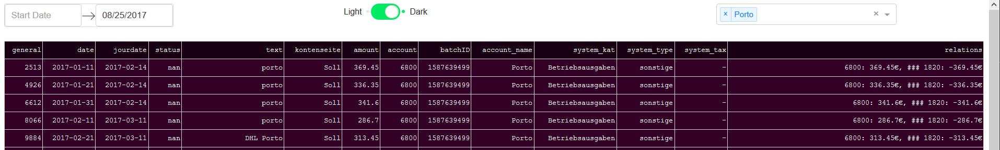
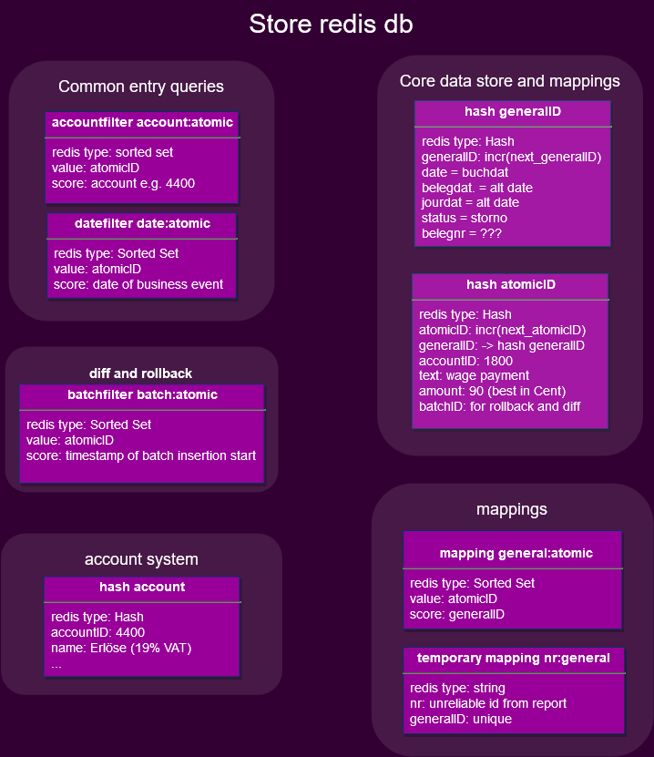

# fastcounting
Fastcounting is a python module which helps you to understand your accounting data.
Accounting Software is localized and comes with much functionality.

We take a step back and only implement the ground truth.
And we make it easy for you to ask your own questions.

The basic use case right now is make queries against our views.
Our backend store should allow us to easily introduce new functionality when needed.

# setup
Friendly reminder that you will have to do some preprocessing of your data.

install redis server 6  
start redis server 6  
Get python environment e.g with conda:
- conda create -n pauline
- conda install nb_conda
- git clone https://github.com/elcolumbio/fastcounting.git
- cd fastcounting
- pip install -r requirements.txt
- pip install .
- jupyter lab
- select kernel pauline  
We can use conda install -f requirements.txt the moment redis 3.4.2 is released

# Motivation
Standard accounting software is often insufficient for data to analizing.
E-Commerce companies typicaly have 100s or 1000s of transactions for each day.

So let's export and save the data in a csv or sql.
The data you export from your accounting software is very misplaced in a 2 dimensional table.
The rows aren't representing atomic transactions and in accounting you have 3 main dimensions.
Here we provide a simple and powerful logic besides tables.  
I just made my first very simple dash app on top of our data core and our views.
It has 2-4 times faster query speed, highly customisable and is accessible. All which my accounting Software isn't able to provide.  

# Example dash app
[github repo elcolumbio/cctable](https://github.com/elcolumbio/cctable)

# memory usage of redisdb in my local ram

type | memory used | info
--- | --- | ---
csv | 2.6 MB | the file we import
csv rows | 61 245 rows | ~ number of transactions(multi tax = 1 transaction)
number atomic | 181 224 entries | number of atomic transactions
accountsystem | 0.16 MB | we join for more meaningful output
**without views** | 108 MB | core db
atomic hashes | 181 224 | -
general hashes | ~ 65 000 | -
sorted sets | 4 with a length of 181 224 | -
**with views** | 186 MB | core db and views
same as without views | "" | ""
atomic view | 181224 entries | big stream with fields joined
account view | 90 with total of 181 224 entries | we distribute data over accounts

# What is the minimum viable data and the relations of it?

**Account** is a collection of related accounting entries

**Accounting transaction** links two or more entries together, so the total of all entries is zero.

Our naming convention for 'entries' is: atomic.
And our naming convention for 'accounting transaction' is: general.

# How do we handle amounts
We transfer every number to the balance side, where this very account is increasing.
That means you don't need to look at the balance side, you will see just by the value.
If the account is increasing or decreasing.

To do this we need to categorize all accounts with the help of our standard accounting frame.
E.g. in Germany we have SKR04, there we have 8 main classes 0-7. Only in the 8th and last class we have mixed accounts.  
0-1 : active accounts (incr left)  
2-3 : passive accounts (incr right)  
4 : revenues (incr right)  
5-6 : expenditures (incr left)  
7 : revenues and expenditures  
So we need more information for 7. There is a category column in our accounting frame.
We have only 3 groups for 7. Einnahmen = revenue and Abschreibungen, Betriebsausgaben = expenditures.
Like this we matched all accounts which are part of your final reporting.

# efficient queries
underlying dimensions of accounting:
- date
- account
- relations  
For now we focused on the first Two.

Backup queries:
- aggregation -> we leverage lua scripts and one dimensional arrays to combine filtering and lookup in lua.
- atomic -> we seperate and make filter easy to use and we have one lookup function: atomics in and details out
  alternative atomic
Most data stays in redis.

View queries:
Build on top of our Backend very easy to create and delete and to query against.
- atomic view -> all the data you can filter by date
- account views -> for every account -> a stream you can filter by date too

Batch processing:
We have some capabilities in our backend, but we won't implement it for now.
We want to have easy remove and rollback logic, useful if you want to do some trial and error analysis.
Also to get meaningful Diff Views would be very nice.

# language barrier
From my understanding accounting terms are in the official language for each country.
I still have to replace some german and maintain a dictionary.

# Features
- Event driven
- data rebuild-able
- simplicity
- fast read
- multi state diffs
- useful queries
- data validation

# Data Structure

